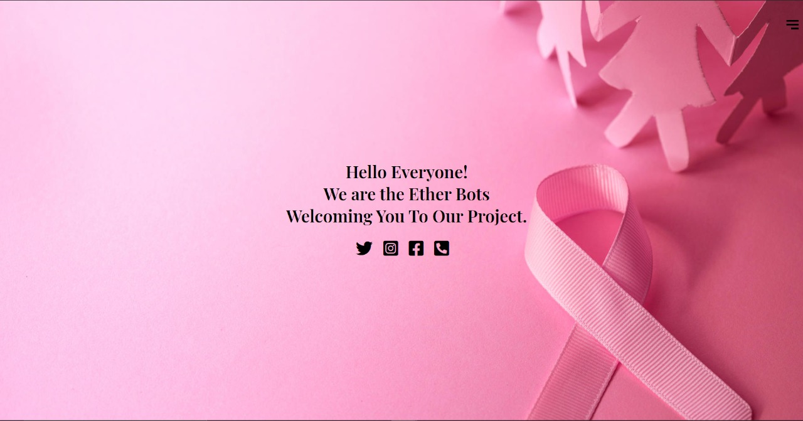
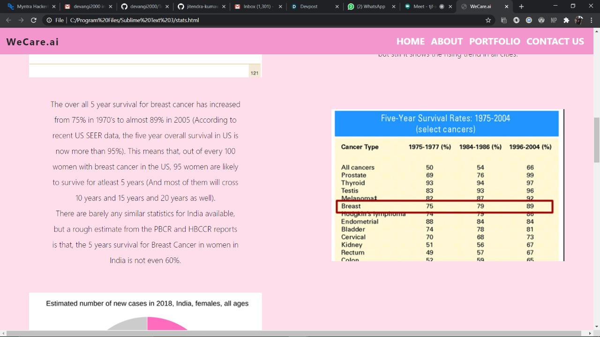
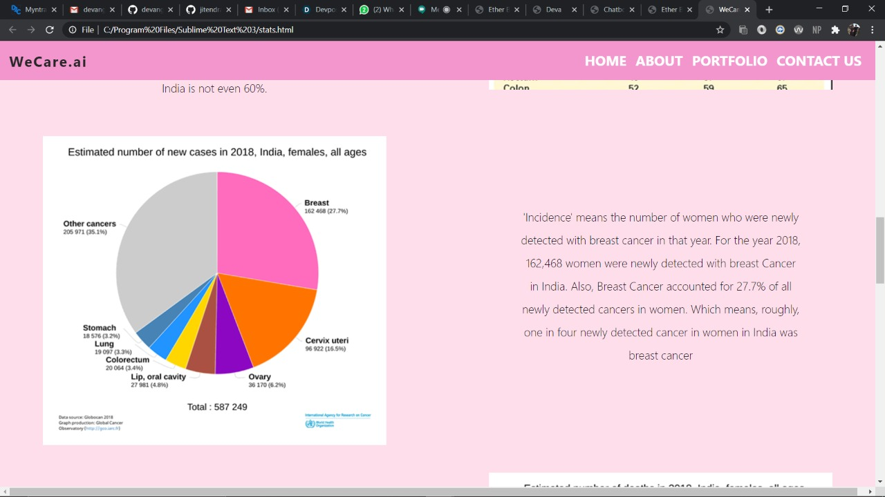
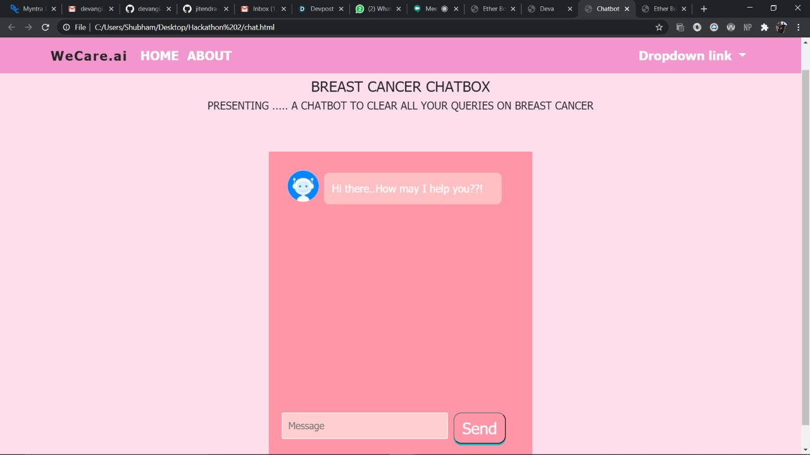
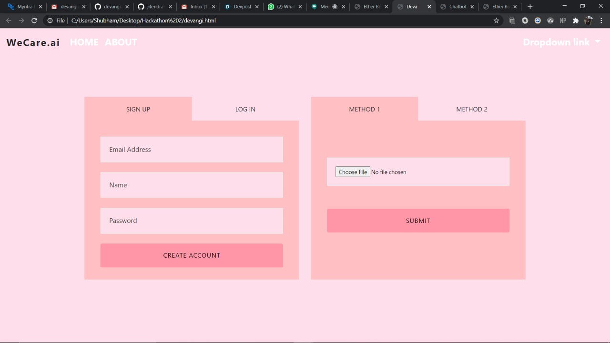
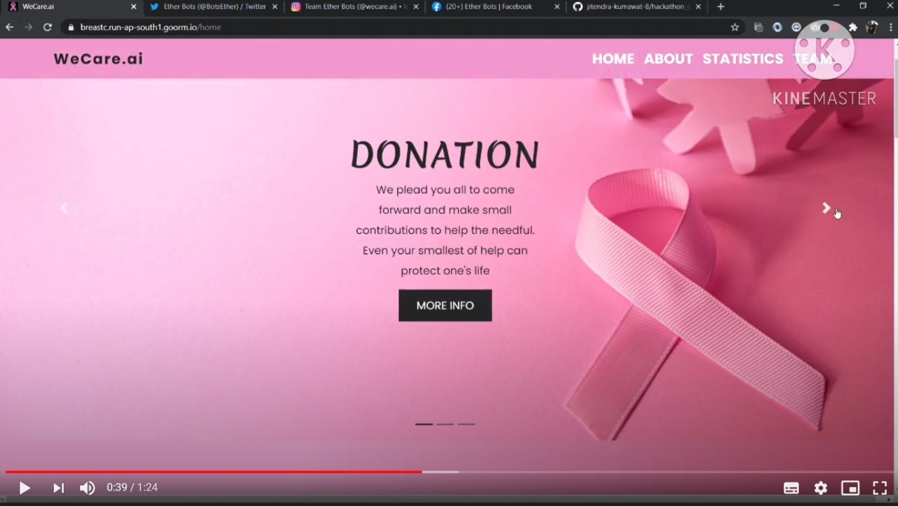

<h1 align="center">WeCare.ai</h1>

<i>Serving Through AI, one step at a time.</i>

  
  
  
  
  
  

 

<i>Loved the project? Please visit our <a href="#">Website</a></i>

 

## Inspiration
>The number of breast cancer cases in India are increasing day by day at a significant rate. The main problem arises when women are unable to detect this cancer at an early stage. This can be either due to lack of money or unawareness about the topic. It's our priority to raise awareness for Breast Cancer and detect breast cancer at an early stage in life and hence we have made a software that checks the symptoms and also examines the histopathology images and predicts whether the user is having breast cancer or not. 

## What it does? 

>Our team at WeCare.ai successfully built and deployed an integrated Artificial Intelligence solution that caters to all needs pertaining to a patient who is diagnosed with a metastatic tumor. WeCare.ai’s website endows an interactive portal for users to explore any information regarding breast cancer. The research team is proud to develop a contextual virtual assistant integrated with the main website that can answer any query regarding breast cancer, from providing information regarding fundamentals of breast cancer to performing symptom analysis of patients, from displaying statistics and visualization plots to conducting virtual counseling session for our users, this know-it-all bot is more than sufficient to resolve any inquiry. Another state-of-the-art solution brewed in WeCare.ai’s kitchen is the tumor classification web-app that can predict the presence or absence of metastatic or invasive ductal carcinoma just by uploading the histopathology image. While designing this product for our clientele, our team only kept one thing in mind: Serving through AI, One Step at a Time.

----------------

## How we built it? 

>WeCare.ai has a fully responsive website developed with the help of HTML5, CSS3 and JavaScript. The Backend section utilizes Flask for deployment. This website has the basic information about the research and development team and how does our team work to help the patients win the fight against breast cancer. WeCare.ai’s chatbot is assembled based on fundamentals of NLP and trained on a curated dataset that our team has collected from reputed sources and medical professionals. The data is fed into a JSON file which contains intents along a tag with patterns and their corresponding responses, as soon as our sequence model built using PyTorch classifies the seed sentence of the user to one of the tags the corresponding response is displayed instantly. The deployment of the chatbot was done on Flask on the Heroku cloud platform. The classifier used for assessing whether a user has a metastatic tumor or not was trained using Convolutional Neural Networks and managed to get an accuracy of 98.2%. The model is deployed using the Flask micro-framework in an interactive, responsive web application where a user can directly upload images for prediction. Alternatively, the users can choose to preserve the records in our database, by signing up and providing basic details.

---------------
## Challenges we ran into
>As the world shifted to a phase of remote learning during these uncertain times, our team at WeCare.ai did the same. However, with the enforcement of any new regulation, complications are bound to occur.
> <ol>
><li> The most notable challenge was gathering the required dataset for training the model.</li>
><li> Deploying our models within a specific amount of time was a bit much of a challenging task.</li>
><li> The major challenge our team faced was integration of all the different technical frameworks and toolkits into one dynamic responsive website. </li>
></ol>
>Nevertheless, with the sheer resolute and gumptious attitude of each member, we were able to successfully overcome this problem to serve you better.
---------------

## What did we learn?
>The idea itself was overwhelming, and challenged us to push our limits. We learnt the methodical way to implement a mere idea, into something that can benefit the society and serve as motivation for improvement. We mastered the Art of Solution-Building and integrating Society related problems into Technological Solutions. Through the challenges, we absorbed a lot of Web Development and Machine Learning/ Deep Learning tactics, leveraging State-of-the-art algorithms and techniques to achieve high accuracy and performance.

---------------

## What's next?
>In addition to the chatbot, Team EtherBots is working towards developing and incorporating speech recognition for multiple languages, in order to be able to connect with a wider population.
Moreover, we intend to be able to identify several other diseases by using the State-of-the-art algorithms and techniques for classification and early identification of anomalies.

⭐ From [TeamEtherBots](https://github.com/devangi2000/TeamEtherBots)  
